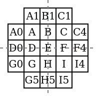
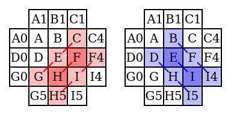
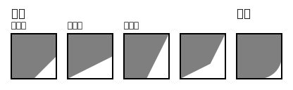
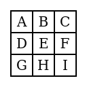
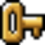
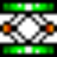

xBRZ 是一种针对图像整数倍放大的插值算法。ACNH 就[用这种算法](https://twitter.com/lunasorcery/status/1242569546038460416)放大设计图案。~~（不这样说是不是没人看？~~

## 算法

首先在图像上进行边缘检测，然后沿着边缘插值。

> 注：下文可以配合代码食用。边缘检测部分对应[原实现](https://sourceforge.net/projects/xbrz/files/xBRZ)中的 `preProcessCorners` 函数；插值部分对应 `blendPixel` 函数。

### 边缘检测

对于每个像素 $ \mathrm E $ 和周围的像素：

> 注：因为上面的图形关于 $ \mathrm x $ 和 $ \mathrm y $ 轴对称，所以接下来只考虑右下角。

如果 $ \mathrm E $、$ \mathrm F $ 或 $ \mathrm E $、$ \mathrm H $ 颜色相同，那么 $ \mathrm{HF} $ 上一定不存在边缘。否则，分别计算 $ \mathrm{\color{red}HF} $ 和 $ \mathrm{\color{blue}EI} $ 方向上的色差（把每个像素看作 [YCbCr 色彩空间](https://zh.wikipedia.org/wiki/YCbCr)中的向量）：

$$ \begin{aligned}d_\mathrm{\color{red}HF}&=|\mathrm G-\mathrm E|+|\mathrm E-\mathrm C|+|\mathrm{H5}-\mathrm I|+|\mathrm I-\mathrm{F4}|+4|\mathrm H-\mathrm F|\\d_\mathrm{\color{blue}EI}&=|\mathrm D-\mathrm H|+|\mathrm H-\mathrm{I5}|+|\mathrm B-\mathrm F|+|\mathrm F-\mathrm{I4}|+4|\mathrm E-\mathrm I|\end{aligned} $$

如果 $ d_\mathrm{\color{red}HF}<d_\mathrm{\color{blue}EI} $，那么 $ \mathrm{HF} $ 上存在边缘。把 $ 4d_\mathrm{\color{red}HF}<d_\mathrm{\color{blue}EI} $ 的边缘称为**主边缘**。

### 插值

因为只是沿着边缘插值，距离边缘较远的像素可以保留原来的颜色，所以先进行[最近邻插值](https://zh.wikipedia.org/wiki/%E6%9C%80%E8%BF%91%E9%82%BB%E6%8F%92%E5%80%BC)。

为了使放大后的图片看起来不模糊 ~~（点名批评[双线性插值](https://zh.wikipedia.org/wiki/%E5%8F%8C%E7%BA%BF%E6%80%A7%E6%8F%92%E5%80%BC)）~~，xBRZ 采取模式识别的方式。像素的每个角可以是**线形**或**圆形**，线形又分为**对角线**、**缓坡线**、**陡坡线**或后两者的叠加。

如果 $ \mathrm{HF} $ 上存在边缘，那么右下角一般是线形。但当这个边缘不是主边缘时，就要考虑特殊情况，据此判断右下角是否为圆形：

* 相邻的两个角同时是线形时，看起来会[很奇怪](mario-4x-bad.png "注意眼睛")，所以当 $ \mathrm{BF} $ 或 $ \mathrm{DH} $ 上也存在边缘时，右下角是圆形。
* $ \mathrm G $、$ \mathrm H $、$ \mathrm I $、$ \mathrm C $、$ \mathrm F $ 形成 L 形图案时，$ \mathrm E $ 的右下角[不能是线形](super_mushroom-4x-bad.png "注意眼睛")，所以当 $ \mathrm E $、$ \mathrm I $ 不相近，但 $ \mathrm G $、$ \mathrm H $，$ \mathrm H $、$ \mathrm I $，$ \mathrm I $、$ \mathrm F $，$ \mathrm F $、$ \mathrm C $ 都相近时，右下角是圆形（颜色 $ \mathrm A $、$ \mathrm B $ 相近指 $ |\mathrm A-\mathrm B|<\frac{30}{255} $）。

对于线形角：

$$ \begin{aligned}d_\mathrm{FG}&=|\mathrm F-\mathrm G|\\d_\mathrm{HC}&=|\mathrm H-\mathrm C|\end{aligned} $$

* 如果 $ 2.2d_\mathrm{FG}≤d_\mathrm{HC} $ 而且 $ \mathrm E $、$ \mathrm D $ 的颜色都与 $ \mathrm G $ 不同，那么存在缓坡线。
* 如果 $ 2.2d_\mathrm{HC}≤d_\mathrm{FG} $ 而且 $ \mathrm E $、$ \mathrm B $ 的颜色都与 $ \mathrm C $ 不同，那么存在陡坡线。
* 如果既没有缓坡线又没有陡坡线，那么只能是对角线。

确定角的形状后，就可以用 $ \mathrm H $ 和 $ \mathrm F $ 中与 $ \mathrm E $ 相差较小的颜色填充。

## 实例

| 最近邻 | 双线性 | xBRZ |
|-|-|-|
|  |  |  |
|  |  |  |
|  |  |  |
|  |  |  |

---

部分图片来自 [xBR algorithm tutorial](https://forums.libretro.com/t/xbr-algorithm-tutorial/123) 和 [Super Mario World](https://www.mariowiki.com/Super_Mario_World)。
